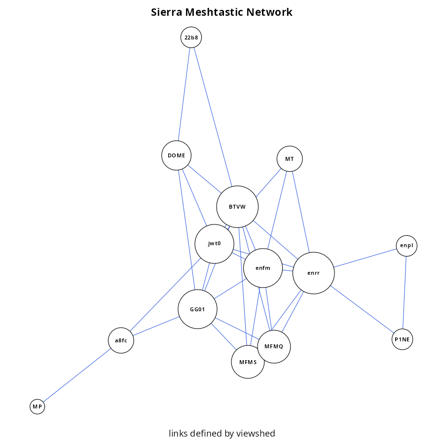

# meshnet-planning
Meshtastic Node Placement in Complex Terrain

# Mesh Network Described via Viewshed Analysis

Using known locations for Meshtastic nodes and a digital elevation model (DEM), estimate network connectivity via iterative [viewshed analysis](https://grass.osgeo.org/grass84/manuals/r.viewshed.html). Terrain modeling and viewshed analysis are performed with [GRASS GIS](https://grass.osgeo.org). Node connectivity is determined by sampling all viewshed maps at each node location, resuting in an adjacency matrix of 0s (no visibility) and 1s (visibility) describing each pair of nodes. From this adjacency matrix, a graph representation of network topology is constructed using the [igraph package](https://r.igraph.org) for R. In the figure below, local Meshtastic nodes (labeled with short names) are represented with circles and connections by lines. Circle size is proportional to the number of connections made with other nodes.

Links to related GRASS modules.
 * [r.viewshed](https://grass.osgeo.org/grass84/manuals/r.viewshed.html)
 * [r.viewshed.cva](https://grass.osgeo.org/grass-stable/manuals/addons/r.viewshed.cva.html)
 * [r.viewshed.exposure](https://grass.osgeo.org/grass-stable/manuals/addons/r.viewshed.exposure.html)
 * [r.skyline](https://grass.osgeo.org/grass-stable/manuals/addons/r.skyline.html)
 * [r.skyview](https://grass.osgeo.org/grass-stable/manuals/addons/r.skyview.html)

# Mesh Network Described via Successful Traceroute

The [MeshSense](https://affirmatech.com/meshsense) tool was used to collect traceroute results from a local node (OxFC). Legs of traceroute records were converted into individual segments representing "edges" of a graph. The resulting graph is shown below: circles are Meshtastic nodes (labeled with short names), lines are the inferred connections within the network. Circle size is proportional to the number of connections made with other nodes.

# Meshtastic CLI

Best CLI meshtastic app seems to be [contact](https://github.com/pdxlocations/contact).

## CLI tools
 - https://github.com/pdxlocations/contact
 - https://github.com/iandennismiller/fmesh
 - https://github.com/ethzero/meshtastic-live-node-list
 - https://www.reddit.com/r/meshtastic/comments/190bw6c/guide_to_install_the_python_cli_and_configure/
 - https://github.com/datagod/meshwatch
 - https://meshtastic.org/docs/software/linux/usage/
 - https://vftp.net/N0ZYC/radio/meshtastic/nodes/node%20resources/meshtastic%20CLI/

## Node DB
 - https://github.com/pdxlocations/meshdb
 - dump node DB: `meshtastic --nodes > file` pretty-printed, but annoying to use
 - careful: `meshtastic --info > file` includes private keys!

## setup meshtastic CLI
 - https://meshtastic.org/docs/software/python/cli/
 - add user to dialout group
 - serial interface on /dev/ttyACM0

## Ubuntu Python Modules
 - python3 -m venv .python-env
 - add "~/.python-env/bin" to PATH 
 - .python-env/bin/pip install --upgrade pytap2
 - .python-env/bin/pip install --upgrade "meshtastic[cli]"
 - .python-env/bin/pip install "contact"
 - .python-env/bin/pip install "meshdb"

## python meshtastic module examples
 - https://github.com/pdxlocations/Meshtastic-Python-Examples/blob/main/print-traceroute.py
 - https://github.com/brad28b/meshtastic-cli-receive-text/blob/main/read_messages_serial.py
 - https://skylosblog.com/posts/meshtastic-client-code/

## Ideas
 - long-term monitoring -> logging -> analysis
 - CLI chat / interaction with nodes vs. phone

